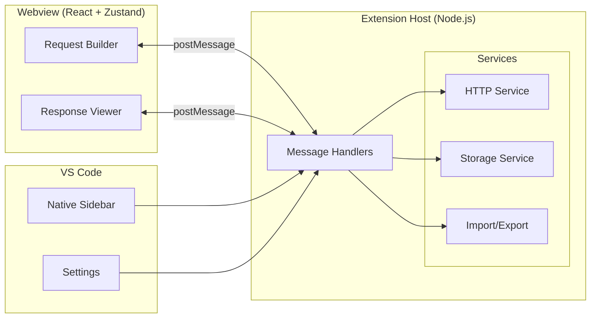
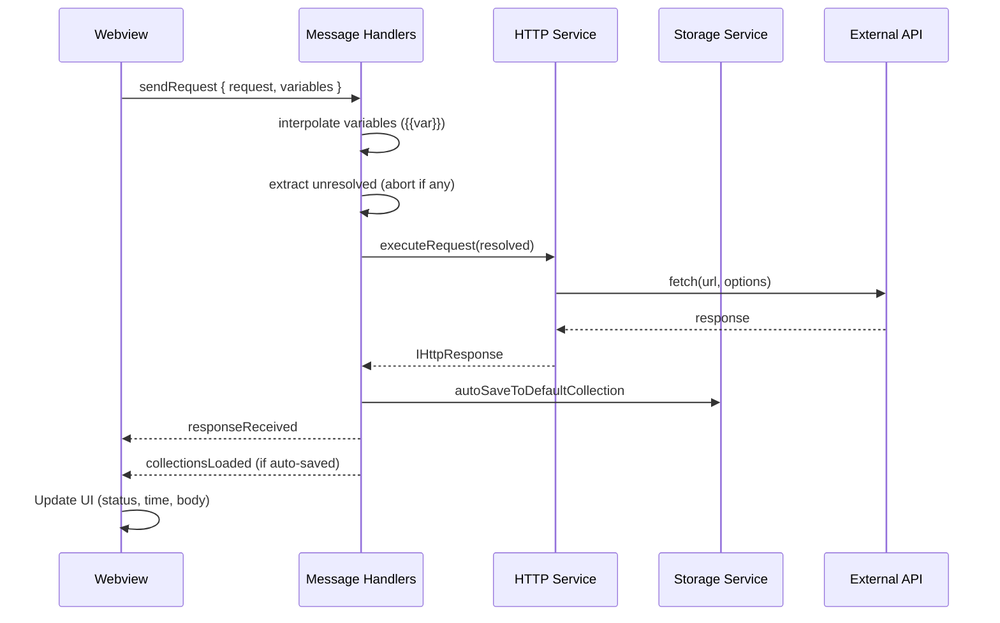

<p align="center">
  
</p>

<h1 align="center">JoltAPI</h1>

<p align="center">
  <strong>A UI-driven REST API client for VS Code</strong><br />
  Build, send, and inspect HTTP requests without leaving the editor.
</p>

<p align="center">
  
  
  
</p>

---

## Overview

JoltAPI brings a Postman-like REST API client into VS Code. It keeps you in the editor with a full-featured request builder, syntax-highlighted response viewer, variable interpolation, collections, history, and auth helpers — all powered by Node.js native `fetch` with zero runtime dependencies.



---

## Features

| Category | Feature |
|----------|---------|
| **HTTP Methods** | `GET` `POST` `PUT` `PATCH` `DELETE` `HEAD` `OPTIONS` |
| **Request Builder** | URL bar with `{{variable}}` highlighting, headers editor with autocomplete, query params (real-time URL sync), tabbed body editor (JSON, form-data, raw), cURL copy |
| **Auth** | Bearer Token, Basic Auth, API Key *(sensitive fields use `type="password"`)* |
| **Response Viewer** | Status code + time + size labels, syntax-highlighted JSON body, response + request headers with variable interpolation |
| **Variables** | Flat `{{key}}` interpolation at send time, plain JSON file, unresolved variable detection before request |
| **Collections** | Organize requests by collection in native sidebar tree, move between collections, auto-save to Default |
| **History** | Request replay, truncation at 10KB, configurable limit via `joltapi.historyLimit` |
| **Multi-tab** | Up to 10 request tabs, each with independent state, unsaved-change warning on switch |
| **Import/Export** | Postman Collection v2.1, Insomnia, `.joltapi.json` |
| **Proxy** | Per-request + global proxy with authentication |
| **Settings** | Timeout, SSL verification, follow redirects, max redirects, default headers |
| **Security** | CSP with per-session nonce, `crypto.randomUUID()`, postMessage origin validation, URL redaction in logs, shell-escaped cURL |

---

## Architecture

```
┌──────────────────────────────────────────────────────────┐
│                    Extension Host                        │
│                                                          │
│  ┌──────────┐   ┌─────────────┐   ┌──────────────────┐  │
│  │ commands/│   │   panels/    │   │    services/     │  │
│  │          │   │              │   │                  │  │
│  │ openPanel│──▶│ webviewPanel │──▶│ httpService      │  │
│  │          │   │ msgHandlers  │   │ storageService   │  │
│  │          │   │  handlers/   │   │ importService    │  │
│  │          │   │  ├sendRequest│   │ exportService    │  │
│  │          │   │  ├collection │   └──────────────────┘  │
│  │          │   │  ├variable   │                         │
│  │          │   │  ├history    │   ┌──────────────────┐  │
│  │          │   │  ├curl       │   │   providers/     │  │
│  │          │   │  ├settings   │   │                  │  │
│  │          │   │  └importExp  │   │ collections      │  │
│  └──────────┘   └──────┬──────┘   │ history          │  │
│                        │          │ variables        │  │
│              postMessage│         └──────────────────┘  │
├────────────────────────┼────────────────────────────────┤
│                        │     Webview (React)            │
│                        ▼                                │
│  ┌─────────────────────────────────────────────────┐   │
│  │  MainView                                       │   │
│  │  ├── RequestTabBar (multi-tab)                  │   │
│  │  ├── RequestBuilder                             │   │
│  │  │   ├── UrlBar ({{var}} overlay)               │   │
│  │  │   ├── KeyValueEditor → AutocompleteInput     │   │
│  │  │   ├── BodyEditor (JSON / form-data / raw)    │   │
│  │  │   ├── AuthEditor                             │   │
│  │  │   └── RequestTabs                            │   │
│  │  └── ResponseView                               │   │
│  │      ├── ResponseBody (syntax highlighted)      │   │
│  │      └── ResponseHeaders                        │   │
│  └─────────────────────────────────────────────────┘   │
└──────────────────────────────────────────────────────────┘
```

### Message Flow



---

## Quick Start

```bash
# Clone and install
git clone https://github.com/anomalyco/joltapi.git
cd joltapi
npm install
cd webview-ui && npm install && cd ..

# Build extension host + webview
npm run build

# Open in VS Code and press F5 to launch Extension Dev Host
```

> **Important:** The F5 launch task only compiles TypeScript. Run `npm run build` first or the webview will load stale assets.

### Keyboard Shortcut

| Shortcut | Action |
|----------|--------|
| `Ctrl+Shift+J` / `Cmd+Shift+J` | Open JoltAPI panel |
| `Ctrl+Enter` / `Cmd+Enter` | Send current request |

---

## Storage

All data lives in your workspace under `.joltapi/` — human-readable JSON, VCS-friendly.

```
<workspace>/.joltapi/
├── variables.json          # Flat key-value list
└── collections/
    ├── Default.json        # Auto-created on first launch
    └── <name>.json         # One file per collection
```

| Data | Location |
|------|----------|
| Variables | `<workspace>/.joltapi/variables.json` |
| Collections | `<workspace>/.joltapi/collections/<name>.json` |
| History | VS Code `globalState` (`joltapi.history` key) |
| Settings | `joltapi.*` configuration |

> **Warning:** Variables and auth values are stored in plain text. Do not store production credentials.

---

## Settings

| Property | Type | Default | Description |
|----------|------|---------|-------------|
| `joltapi.timeout` | `number` | `30000` | Request timeout in ms |
| `joltapi.sslVerify` | `boolean` | `true` | Verify SSL certificates |
| `joltapi.followRedirects` | `boolean` | `true` | Follow HTTP redirects |
| `joltapi.maxRedirects` | `number` | `5` | Max redirects to follow |
| `joltapi.defaultHeaders` | `array` | `[]` | Headers added to every request |
| `joltapi.proxy.host` | `string` | `""` | Default proxy host |
| `joltapi.proxy.port` | `number` | `0` | Default proxy port |
| `joltapi.proxy.username` | `string` | `""` | Default proxy username |
| `joltapi.historyLimit` | `number` | `50` | Max history entries |

---

## Variable Interpolation

Use `{{variableName}}` syntax in URLs, headers, body, and auth fields. Variables are resolved at send time.

```mermaid
flowchart LR
    A[User clicks Send] --> B[Load variables from .joltapi/variables.json]
    B --> C[Interpolate {{var}} in URL, headers, body]
    C --> D{Any {{unresolved}}?}
    D -->|Yes| E[Show error: Unresolved variable]
    D -->|No| F[Execute HTTP request]
```

Example: if `base_url = https://api.example.com`, then `{{base_url}}/users` becomes `https://api.example.com/users`.

---

## Dev Workflow

```bash
# Terminal 1: Watch extension host TypeScript
npm run watch

# Terminal 2: Watch webview build
cd webview-ui && npm run dev
```

| Command | What it does |
|---------|-------------|
| `npm run build` | Compile host + build webview |
| `npm run compile` | Host TypeScript only (`tsc`) |
| `cd webview-ui && npm run build` | Webview only (Vite) |
| `npm run lint` | Type-check both projects |
| `npm test` | Run 38 test suite (Mocha) |

---

## Tech Stack

| Layer | Technology |
|-------|-----------|
| Extension host | Node.js + TypeScript |
| Webview UI | React 18 + Zustand + Vite |
| HTTP engine | Node.js native `fetch` (undici) |
| Storage | Workspace JSON files |
| Testing | Mocha + `@vscode/test-electron` |
| Proxy/SSL | undici `ProxyAgent` / `Agent` |

**Zero runtime dependencies.** All HTTP is handled by bundled Node.js.

---

## Project Structure

```
joltapi/
├── src/                          # Extension host (TypeScript)
│   ├── extension.ts              # Entry point
│   ├── commands/                 # VS Code command registrations
│   ├── panels/                   # Webview panel + message handlers
│   │   └── handlers/             # sendRequest, collection, variable, history, ...
│   ├── providers/                # TreeDataProviders (sidebar)
│   ├── services/                 # httpService, storageService, import/export
│   ├── models/                   # TypeScript interfaces (I prefix)
│   └── utils/                    # Logger, validators, formatters
├── webview-ui/                   # Independent React project
│   └── src/
│       ├── main.tsx              # React entry
│       ├── views/                # MainView, RequestBuilder, ResponseView
│       ├── components/           # UrlBar, HighlightedTextarea, KeyValueEditor, ...
│       ├── store/                # Zustand stores (request, response, collection, ...)
│       ├── hooks/                # useMessageListener, useSendMessage
│       └── types/                # Manual mirror of src/models/
└── docs/                         # LLM-private memory (gitignored)
```

---

## License

MIT © JoltAPI

---

<p align="center">
  <sub>Built for developers who live in VS Code.</sub>
</p>
